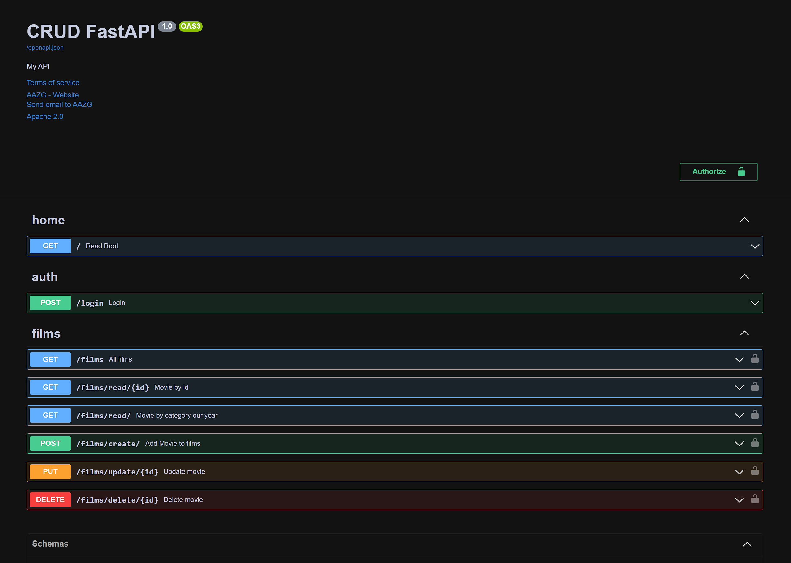

# FastApi introduction: Path operations, validations and authentication.

# Movie API using FastAPI
This API manages a list of movies and allows users to retrieve a list of movies, retrieve a single movie by its id, retrieve a list of movies by category, and add a new movie to the list.

# Dependencies
Python 3.9.15
fastapi==0.95.0
uvicorn==0.21.1
python-dotenv==1.0.0
pyjwt==2.6.0

# Installation
Clone the repository
Install the dependencies using pip install -r requirements.txt
Run the server using uvicorn main:app --reload

# Endpoints
The API has the following endpoints:

Home
GET /
Returns a welcome message as an HTML response. The message includes a title and a list of news items.

Login user
GET /login
return token to used all endpoints

Get all movies
GET /films
Returns a list of all movies.

Get movie by id
GET /films/read/{id}
Returns a single movie with the specified id. If the movie is not found, an empty list is returned.

Get movies by category, by year our by category and year
GET /films/read/
Returns a list of movies filtered by the specified category.

Add new movie
POST /films/create/'
Takes in a new movie as a request body and adds it to the list of movies.

Add update movie
POST /films/update/{id}'
It takes the entered id and the values to update as a request and updates the movie data with that id from the movie list.

Add delete movie
POST /films/delete/{id}'
It takes the id entered as a request and removes the movie with that id from the movie list.

# Usage
To use the API, send requests to the appropriate endpoint using a tool like curl or an API client like Postman.